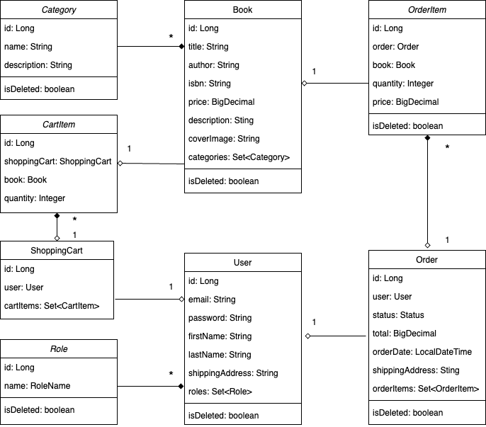

<p align="center">
  
</p>

## 📚 Project description

---
**This project is a Book Catalog Management System, enabling users to browse and purchase books, manage shopping carts, and view their order history. 
It also allows administrators to manage books, categories, and order statuses. 
This system is integrating DTOs, Mapstruct mappers, and enforces a clean service-oriented architecture. 
Adhering to SOLID principles and offers RESTful API design with complete CRUD functionality for book management and additional features like soft delete, search, and user registration.
Application is designed using Spring Boot and Liquibase for database management, implementing JpaRepository for the data layer, and providing secure user registration functionalities. 
Exception handling and data validation are built-in to ensure a robust application, with added support for pagination, sorting, and API documentation through Swagger.**

## 🔥 Features

---
**The system provides the following operations:**

<ins>***Book Management***:</ins>
- ***Retrieve book catalog:*** Fetch a list of all available books
- ***Retrieve book details by ID:*** Get information about a specific book
- ***Create a new book:*** Add a new book to the catalog
- ***Update an existing book:*** Modify book details
- ***Delete a book:*** Remove a book from the catalog (soft delete)
- ***Search books:*** Find books based on title, author, or ISBN

<ins>***User Management***:</ins>
- ***User registration:*** Register new users with validation and exception handling

<ins>***Other***:</ins>
- ***Pagination & Sorting:*** Manage book listings efficiently
- ***Global Exception Handling:*** Handle application exceptions centrally

## 🗺 Project structure

---
**The application follows a 3-tier architecture:**
- ***Controller Layer:*** Handles HTTP requests and responses
- ***Service Layer:*** Contains business logic and manages interactions between the controller and repository layers
- ***Repository Layer:*** Provides data access using JpaRepository for database operations

**The entities involved in this project include:**
- ***User:*** Contains user authentication and personal information.
- ***Role:*** Defines user roles such as USER or ADMIN.
- ***Book:*** Represents books available in the store.
- ***Category:*** Categorizes books.
- ***ShoppingCart:*** Represents a user's shopping cart.
- ***Order:*** Represents a purchase order.
- ***OrderItem:*** Represents individual items within an order.



## 🪄 Used technologies

---
**The following technologies were used:**
- Spring Boot (Java Framework for building the API)
- Spring Security (Authentication and authorization management)
- MySQL (Relational database for persistent storage)
- Hibernate (ORM tool for database interaction)
- Liquibase (Database migrations)
- Docker & Docker Compose (Containerization and environment management)
- JUnit & Mockito (Unit testing and mocking)
- Swagger (API documentation and testing)
- Maven (Build automation tool)
- Postman (API testing tool)

## 🚀 How to run the project

---
**To start the project you need to do the following:**
1. Download the [Project](https://github.com/serhii-shyian/bookstore-app) from GitHub and save it
2. Download [JDK](https://www.oracle.com/java/technologies/downloads/) and install it on computer
3. Download [IntelliJ IDEA](https://www.jetbrains.com/idea/download) and install it on computer
4. Download [MySQL](https://dev.mysql.com/downloads/installer/) and install it on computer
5. Download [Workbench](https://dev.mysql.com/downloads/workbench/) and install it on computer
6. Download [Docker](https://www.docker.com/products/docker-desktop/) and install it on computer
7. Open IntelliJ IDEA and load the previously saved project
8. Open the .env file (/.env) and replace YOUR_PASSWORD with the password that was specified when installing
   <br> MySQL for settings connecting the project to the database
```java
MYSQL_ROOT_PASSWORD=YOUR_PASSWORD;
```
9. To run the project press the Run button
10. The application will be accessible at http://localhost:8080.
11. To run the project using Docker Compose execute the following command in the terminal:
```java
mvn clean package

docker-compose up
```
12. The application will be accessible at http://localhost:8088.

## 🤖 How to test the project

---
**Register at [Postman](https://www.postman.com/) and start testing the service**

You can import a collection of test queries from **postman_local.json** (/postman_local.json)
or **postman_docker.json** (/postman_docker.json) from the project folder if running locally or running via docker respectively, 
or use the following login and password to create test queries manually.
```java
#Admin role
login: admin@i.ua;
password: qwerty;

#User role
login: user@i.ua;
password: qwerty123;
```

| **Http** | **Endpoint**                     | **Roles**   | **Description**                                               |
|----------|----------------------------------|-------------|---------------------------------------------------------------|
| POST     | /auth/register                   | ALL         | Register new user with email and password                     |
| POST     | /auth/login                      | ALL         | Authenticate user with email and password                     |
| GET      | /books                           | USER        | Get all available books                                       |
| GET      | /books/{id}                      | USER        | Get details of a specific book by its ID                      |
| GET      | /books/search                    | USER        | Search books by title, author, or other criteria              |
| GET      | /categories                      | USER        | Get all book categories                                       |
| GET      | /categories/{id}                 | USER        | Get a specific book category by its ID                        |
| GET      | /categories/{id}/books           | USER        | Get all books under a specific category                       |
| GET      | /cart                            | USER        | Get the user's current cart                                   |
| POST     | /cart                            | USER        | Add items to the user's cart                                  |
| PUT      | /cart/items/{cartItemId}         | USER        | Update a specific item in the user's cart                     |
| DELETE   | /cart/items/{cartItemId}         | USER        | Remove a specific item from the user's cart                   |
| GET      | /orders                          | USER        | Get the user's order history                                  |
| POST     | /orders                          | USER        | Create a new order from the user's cart                       |
| GET      | /orders/{orderId}/items          | USER        | Get items from a specific order by its ID                     |
| GET      | /orders/{orderId}/items/{itemId} | USER        | Get details of a specific order item by its ID                |
| POST     | /books                           | ADMIN       | Add a new book to the catalog                                 |
| PUT      | /books/{id}                      | ADMIN       | Update details of a specific book                             |
| DELETE   | /books/{id}                      | ADMIN       | Remove a specific book from the catalog                       |
| POST     | /categories                      | ADMIN       | Add a new book category                                       |
| PUT      | /categories/{id}                 | ADMIN       | Update details of a specific category                         |
| DELETE   | /categories/{id}                 | ADMIN       | Remove a specific category                                    |
| PUT      | /orders/{id}                     | ADMIN       | Update order status                                           |

## 🎬 Video overview

---
**[Link to Loom video](https://www.loom.com/share/b0648c0c22824300869b25e4606b9870)**
